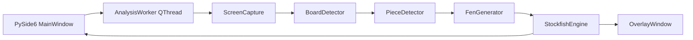

# Architecture

The application separates desktop UI, capture, computer vision, chess logic, and engine execution.

## Runtime flow

## Modules

- `capture/window_detector.py`: enumerates visible Windows desktop windows and selects likely Chess.com browser windows.
- `capture/screen_capture.py`: captures only the selected region with `mss`.
- `vision/board_detector.py`: detects a square board by scoring 8x8 color regularity.
- `vision/square_mapper.py`: converts pixel grid rows and columns to algebraic squares for normal or flipped orientation.
- `vision/piece_detector.py`: defines the detector protocol and a template-matching implementation.
- `vision/fen_generator.py`: converts detected pieces into a validated FEN.
- `engine/stockfish_engine.py`: owns the UCI process and converts Stockfish output into UI-ready analysis models.
- `ui/main_window.py`: owns controls, worker thread wiring, preview rendering, and keyboard shortcuts.
- `overlay/overlay_window.py`: paints click-through always-on-top arrows on the detected board.

## Threading

The UI thread never performs capture or engine work. `AnalysisWorker` captures frames, runs board detection, reconstructs FEN, and asks Stockfish for analysis in the background. Signals carry images, FEN, status text, statistics, and engine results back to the UI.

Full board recognition is throttled separately from capture so the app can keep the overlay responsive without asking Stockfish to analyze unchanged frames. After the user makes a legal move from the last analyzed position, the overlay clears and waits until the opponent changes the board again.

## Extension points

- Implement another `PieceDetector` for YOLOv8 or ONNX models.
- Add clock or move-list parsing to infer side to move.
- Persist calibrated board positions per browser window.
- Add a dedicated rendering thread if overlay drawing becomes heavier.
